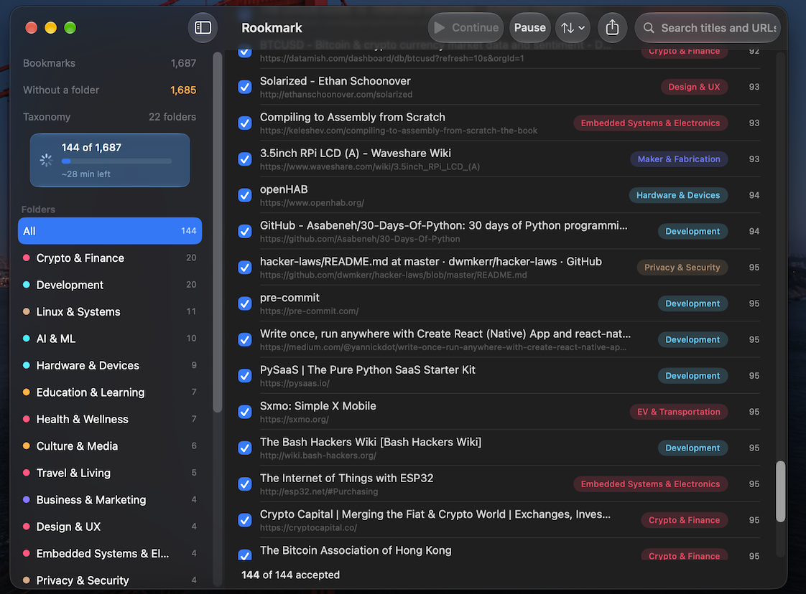

<p align="center">
  
</p>

<h1 align="center">Rookmark</h1>

<p align="center">
  Sorts a pile of browser bookmarks into sensible topic folders, using the
  on-device language model built into macOS.<br>
  Nothing is uploaded, nothing is deleted, and no account is required.
</p>

_Rooks cache things and remember where they put them, that's why!_

## Problem & Solution

If you're anything like me, you keep finding interesting content around the web
but never take the time to organize it properly. Or, a botched browser migration
wipes what you've painstakingly organized by hand.

Rookmark sorts your pile of bookmarks automatically and proposes a new home for
each one, without exposing any of your content.

<p align="center">
  
</p>

## Requirements

- macOS 26 or later, Apple Silicon, with Apple Intelligence enabled
- Xcode 26+ toolchain to build

The classifier is Apple's `FoundationModels` system model.
There is no Linux or Intel support currently, sorry!

## Install

```
git clone https://github.com/corv89/rookmark
cd rookmark
swift build -c release
```

Check that the model is actually available before anything else:

```
swift run rookmark doctor
```

That reports model availability, the context window, and which embedding
backend is active. If it reports the model as unavailable, nothing else will
work.

## Use it

### Graphical

```
./scripts/make-app.sh      # builds build/Rookmark.app
open build/Rookmark.app
```

Or run it straight from the package during development, which skips the bundle
and therefore shows up as `RookmarkApp` rather than `Rookmark`:

```
swift run -c release RookmarkApp
```

Reads the installed [Orion](https://browser.kagi.com/) profile, classifies a sample or the whole library, and
presents the result for review: folders with counts down the side, items sorted
least-confident-first so your attention lands where the model is weakest, and an
inspector explaining why each item went where it did. Nothing is written until
you press Export.

### Command line

```
# Pull bookmarks straight out of an installed Orion profile
swift run rookmark import-orion -o mybookmarks.html

# Organize any Netscape-format bookmark export
swift run rookmark organize mybookmarks.html \
    --taxonomy-from tuning/consolidated-taxonomy-v5.json \
    --cluster --no-enrich
```

`organize` writes a new HTML file you re-import from your browser's bookmark
manager. Other subcommands: `dedup`, `check-links`, `eval`, `worksheet`,
`import`/`export`/`list`/`search`/`undo`/`status`.

## How it works

```
bookmarks ──▶ taxonomy ──▶ classify ──▶ cluster leftovers ──▶ new HTML
              (pinned or    (batched,     (embeddings group
               generated)    constrained   the residue, the
                             decoding)     model names it)
```

Classification presents bookmarks to the model in small batches against a list
of candidate folders, each with a one-sentence rationale. A runtime
`GenerationSchema` constrains the output so the model can only emit a folder
that actually exists. Items it cannot place confidently go to `Unsorted` rather
than being guessed at, and every item gets a decision: nothing is silently
dropped.

Whatever lands in `Unsorted` can then be clustered by embedding similarity, with
the model naming each cluster, so genuinely new topics become new folders
instead of a junk drawer.

## Accuracy

On 720 hand-labeled placements from a real collection:

| Metric | |
|---|---|
| Coverage (placed / total) | 96.9% |
| Placement precision (accepted / placed) | 84.0% |
| Effective yield (accepted / total) | 81.4% |

Throughput is roughly 1.1 seconds per bookmark on an M4 Max. The on-device model
is a single serialized resource, so this is mostly independent of which Apple
Silicon chip you have; the Neural Engine is the same across the M4 line.

These numbers come from one person's collection and are provisional. See
`docs/EVALUATION.md` for the methodology and `docs/TUNING.md` for the tuning
runbook. The `eval` subcommand reproduces all of it.

## What it will not do

- **It never modifies your browser.** Output is always a new file that you
  choose to import manually, once you're satisfied with the proposed structure.
- **It never sends your bookmarks anywhere.** Classification and embedding both
  run on-device. Optional page-description fetching and liveness checks are the
  only features that touch the network, and they're off by default.

## Known limitations

- Safari's bookmarks are unreadable without Full Disk Access; export from Safari
  and open the file instead. Chrome and Firefox importers are not written yet.
- The taxonomy is flat. We don't generate nested folders.

## License

GNU General Public License v3.0. See [LICENSE](LICENSE).
